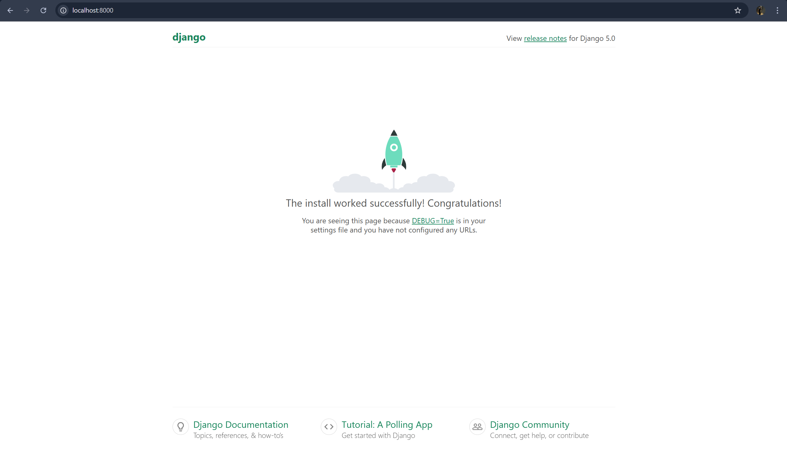

# Simple LMS Django Docker

## Deskripsi Project

Project ini bertujuan untuk melakukan setup **environment development** aplikasi Simple Learning Management System (LMS) menggunakan Django Framework yang dijalankan di dalam container Docker.

Project ini menerapkan konsep **multi-container orchestration** menggunakan Docker Compose sehingga service aplikasi web dan database dapat berjalan secara terpisah namun tetap terhubung dalam satu docker network.

Melalui project ini, mahasiswa dapat memahami konsep containerization, konfigurasi environment, integrasi database PostgreSQL, serta deployment development server berbasis container.

---

## Arsitektur Service

Project ini terdiri dari dua service utama:

### Django Web Application

Berfungsi sebagai backend aplikasi LMS yang menyediakan halaman web dan fitur administrasi Django.

Aplikasi dapat diakses melalui browser:

http://localhost:8000

### PostgreSQL Database

Digunakan sebagai media penyimpanan data aplikasi seperti user, session, dan konfigurasi sistem.

---

## Cara Menjalankan Project

1. Masuk ke folder project

```
cd simple-lms
```

2. Build dan jalankan container

```
docker compose up --build
```

3. Setelah container berjalan, buka browser:

```
http://localhost:8000
```

4. Untuk mengakses halaman admin Django:

```
http://localhost:8000/admin
```

---

## Membuat Superuser Django

Jalankan perintah berikut:

```
docker compose exec web python manage.py createsuperuser
```

---

## Konfigurasi Database

Project ini menggunakan PostgreSQL container dengan hostname service:

```
db
```

Karena berada dalam satu docker network, Django dapat langsung terhubung ke database tanpa konfigurasi IP manual.

---

## Environment Variables

Konfigurasi database disimpan pada file `.env`

Contoh:

```
POSTGRES_DB=lms_db
POSTGRES_USER=lms_user
POSTGRES_PASSWORD=lms_password
POSTGRES_HOST=db
POSTGRES_PORT=5432
```

---

## Screenshot Django Welcome Page



---

## Pengujian

* Docker Compose berhasil menjalankan seluruh container
* Aplikasi Django dapat diakses melalui localhost:8000
* PostgreSQL database berhasil terkoneksi
* Migration database berhasil dijalankan
* Superuser berhasil dibuat

---

## Author

Nama: GEDE PRADISTYA EVAN ARYAPUTRA
NIM: A11.2023.14886
Kelas: 4618
Mata Kuliah: Pemrograman Sisi Server
